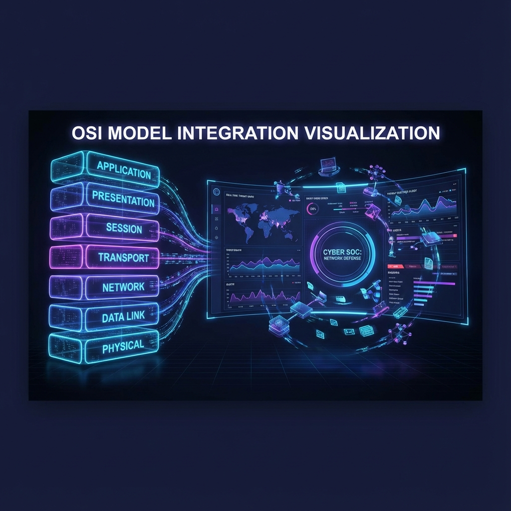
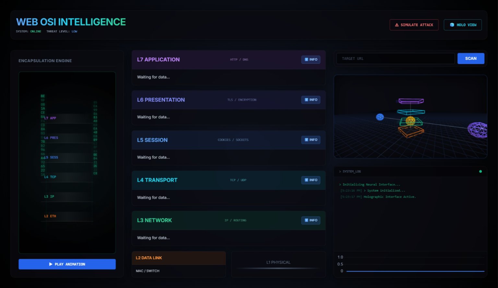

# OSI Visualizer with Cyber SOC UI


A premium, interactive visualization tool designed to bridge the gap between abstract network concepts and real-time security operations. This project features a 3D exploded view of the OSI model integrated with a high-fidelity Cyber SOC dashboard.

## ✨ Features

- **🌐 3D OSI Model**: Interactive, exploded view of OSI layers allowing deep inspection of protocols at each level.
- **🛡️ Cyber SOC Dashboard**: Real-time visualization of simulated security alerts, network traffic, and threat intelligence.
- **⚔️ Attack Simulation**: Visual simulation of DDoS attacks affecting specific OSI layers with real-time feedback.
- **🧬 Protocol Helix**: Dynamic, 3D visualization of network protocols demonstrating encapsulation and decapsulation.
- **⚡ Reactive UI**: Glassmorphism-inspired interface with neon accents, smooth animations, and responsiveness.

## 📸 Visuals

### Attack Simulation & Dashboard


### Live Demo (Video)

<video src="assets/video.webm" controls="controls" width="100%">
    Your browser does not support the video tag.
</video>

## 🚀 Quick Start (Docker)

The easiest way to get the application running is via Docker.

1.  **Prerequisites**: Ensure [Docker Desktop](https://www.docker.com/products/docker-desktop) is installed.
2.  **Clone & Run**:
    ```bash
    git clone <repository-url>
    cd osi-visualizer
    docker-compose up --build
    ```
3.  **Access**: Open [http://localhost:8000/frontend/index.html](http://localhost:8000/frontend/index.html) in your browser.

## 🛠️ Manual Setup

### Prerequisites
- Python 3.10+
- Modern Web Browser (Chrome/Edge recommended)

### Installation Steps

1.  **Create & Activate Virtual Environment**:
    ```bash
    python -m venv venv
    # Windows:
    .\venv\Scripts\activate
    # Mac/Linux:
    source venv/bin/activate
    ```

2.  **Install Dependencies**:
    This project uses `poetry`. If you have poetry installed:
    ```bash
    poetry install
    ```
    
    Or install manually via pip:
    ```bash
    pip install fastapi "uvicorn[standard]" pydantic-settings requests dnspython psutil netifaces aiohttp scapy jinja2 python-multipart email-validator httpx websockets
    ```

3.  **Start Backend**:
    ```bash
    uvicorn app.main:app --reload
    ```

4.  **Access App**:
    Open [http://localhost:8000](http://localhost:8000) in your browser.
    *(The backend automatically serves the frontend)*

## 💻 Tech Stack

- **Backend**: Python, FastAPI, Uvicorn
- **Frontend**: HTML5, CSS3 (Glassmorphism), JavaScript (ES6+)
- **Visualization**: Custom CSS 3D Transforms (No external 3D libraries used for core helix/OSI layers to ensure performance)
- **Containerization**: Docker, Docker Compose

## 📄 License

Distributed under the MIT License. See `LICENSE` for more information.
